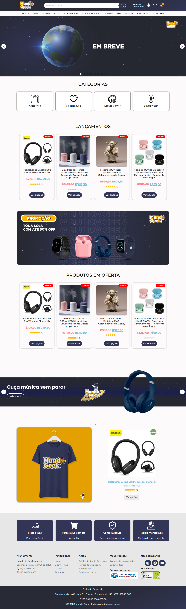
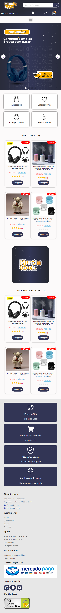
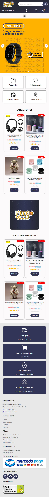

 
 

Projeto de site loja "O Mundo Geek " 😁👍🚀🧑‍🚀

Site responsivo em desenvolvimento, criado para empresa de vendas com produtos segmentados "Geek Universe", logotipia, temática e paleta de cores criada por mim como Designer Gráfico,  plugins de segurança, sistema de busca, otimização, SEO, SSL e mais combinados ao uso da plataforma Dser para link de produtos do Aliexpress.

TECNOLOGIAS que fazem parte deste projeto 🧑‍🚀🚀:

- Wordpress;
- WooCommerce;
- Elementor;
- CSS3;
- Photoshop;
- Illustrator.

Abaixo etapa atual em que o site se encontra, assim que for avançando será atualizado automaticamente.  

O proprietário está migrando de Hospedagem, assim que realocar o site estará disponível<a target="_blank" href="https://www.omundogeek.com"> Clicando aqui!</a>.  
Ou curta as imagens logo abaixo! 😁😍👍👽

Obrigado. (●'◡'●) 
 
 

